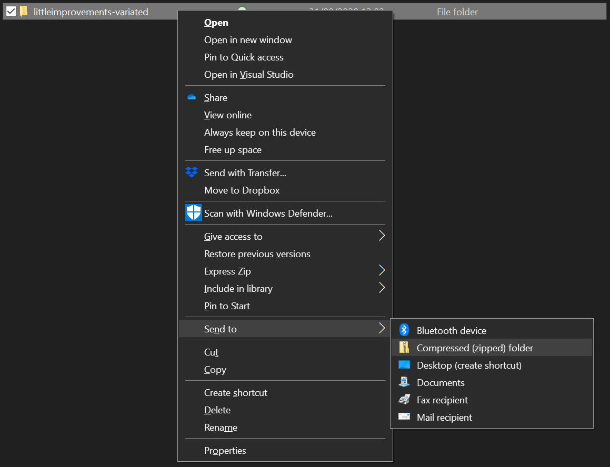
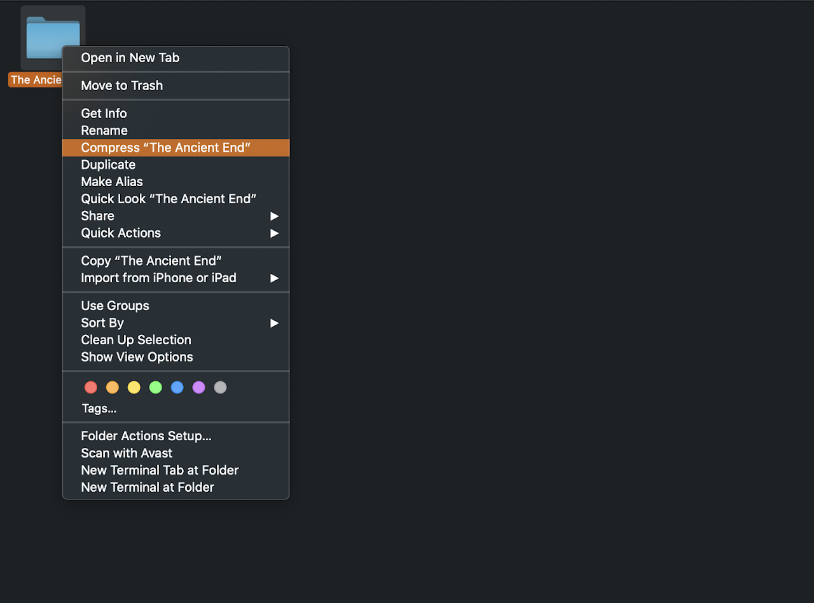
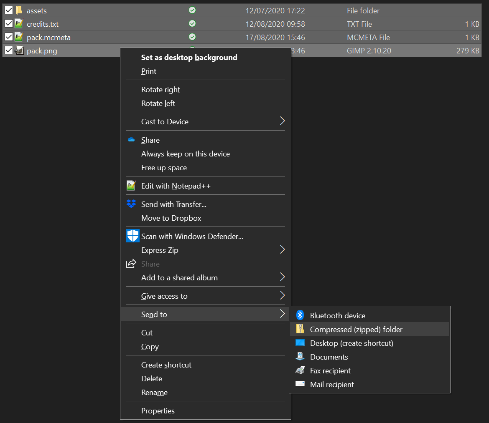
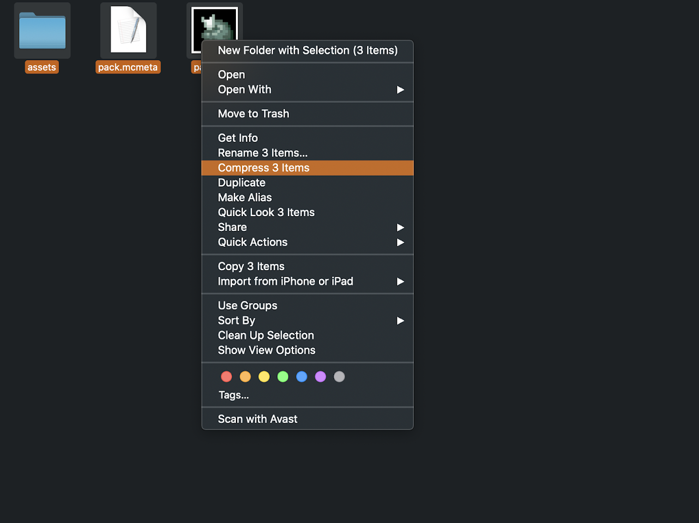

To share a resource pack, you need to make it into a zipped folder. This also needs to be done in a way such that people can put the zip directly into their resourcepacks folder and it will work.  
It is quite common to see resource packs that are not zipped correctly. This page shows how it is frequently done wrong, and how to zip it properly.

## What not to do
Do not zip the folder of the resource pack, as shown in the image.  
When resource packs are zipped like this, it does not show in the resource pack selection screen. This confuses most users, and the only solution is to unzip the pack, and then use a child folder.  
  

## What to do
Zip all the files and folders inside the pack, including assets, pack.mcmeta and pack.png.  
When users download this zip, it will appear directly in their resourcepacks folder.  
  
