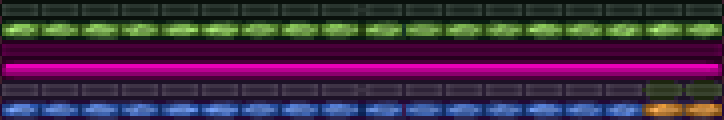

To change GUI icons in resource packs, you have to change one big file called icons.png, which has no explanation whatsoever of what each icon does. Some are fairly obvious, like the main red heart icon, but why are there so many? This page aims to show you where every icon is used.

The file is found at `/assets/minecraft/textures/gui/icons.png` and is a 256x256 image. To find it yourself, [extract your Minecraft assets](/extracting-default-assets).

# icons.png

  
The vanilla `icons.png`.

# Layout

## 9x9 icons

	<table>
		<tr>
			<td>A1</td>
			<td>B1</td>
			<td>C1</td>
			<td>D1</td>
			<td>E1</td>
			<td>F1</td>
			<td>G1</td>
			<td>H1</td>
			<td>I1</td>
			<td>J1</td>
			<td>K1</td>
			<td>L1</td>
			<td>M1</td>
			<td>N1</td>
			<td>O1</td>
			<td>P1</td>
			<td>Q1</td>
			<td>R1</td>
		</tr>
		<tr>
			<td>A2</td>
			<td>B2</td>
			<td>C2</td>
			<td>D2</td>
			<td>E2</td>
			<td>F2</td>
			<td>G2</td>
			<td>H2</td>
			<td>I2</td>
			<td>J2</td>
			<td>K2</td>
			<td>L2</td>
		</tr>
		<tr>
			<td>A3</td>
			<td>B3</td>
			<td>C3</td>
			<td>D3</td>
		</tr>
		<tr>
			<td>A4</td>
			<td>B4</td>
			<td>C4</td>
			<td>D4</td>
			<td>E4</td>
			<td>F4</td>
			<td>G4</td>
			<td>H4</td>
			<td>I4</td>
			<td>J4</td>
			<td>K4</td>
			<td>L4</td>
			<td>M4</td>
			<td>N4</td>
		</tr>
		<tr>
			<td>A5</td>
		</tr>
		<tr>
			<td>A6</td>
			<td>B6</td>
			<td>C6</td>
			<td>D6</td>
			<td>E6</td>
			<td>F6</td>
			<td>G6</td>
			<td>H6</td>
			<td>I6</td>
			<td>J6</td>
			<td>K6</td>
			<td>L6</td>
			<td>M6</td>
			<td>N6</td>
			<td>O6</td>
			<td>P6</td>
			<td>Q6</td>
			<td>R6</td>
		</tr>
	<table>

### Row 1: Hearts

A1  
The empty heart texture. This contains the outline for normal, full hearts as well.

B1  
When hearts flash with a white outline (when healing or taking damage), A1 gets replaced by this.

C1  
When hearts flash with a red outline (not sure when), A1 gets replaced by this.

D1  
Unused. Would give hearts a white outline.

E1 & F1  
The normal, full heart texture. This is overlayed on top of the relevant empty heart texture (A1-D1), depending on which colour the outline is flashing. The second texture (F1) is when there is half a heart, instead of a full one.

G1 & H1  
When hearts turn pink (flashes when taking damage), E1/F1 get replaced by these. The second texture (H1) is when there is half a heart, instead of a full one.

I1 & J1  
When hearts turn this greenish colour under the Poison effect, E1/F1 get replaced by these. The second texture (J1) is when there is half a heart, instead of a full one.

K1 & L1  
When hearts turn this beige colour (flashes when taking damage under the Poison effect), E1/F1 get replaced by these. The second texture (L1) is when there is half a heart, instead of a full one.

M1 & N1  
When hearts turn black under the Wither effect, E1/F1 get replaced by these. The second texture (N1) is when there is half a heart, instead of a full one.

O1 & P1  
When hearts turn this grey and red colour (flashes when taking damage under the Wither effect), E1/F1 get replaced by these. The second texture (P1) is when there is half a heart, instead of a full one.

Q1 & R1  
Yellow hearts created by the Absorption effect use these textures instead of E1/F1. The second texture (R1) is when there is half a heart, instead of a full one.

### Row 2: Armour & Horses

A2-C2  
These are the icons for armour points, shown above the health bar. They are the empty, half and full ones respectively.

D2  
Is another full armour icon. Unused.

E2-L2  
Are like A1-H1, but for mob health (horses, pigs, etc), shown instead of the hunger bar.

### Row 3: Water Bubbles

A3  
This is a full water bubble, shown above the hunger bar.

B3  
This is the icon that quickly shows when a bubble "pops", or runs out. There is no icon shown after that.

C3 & D3  
Unused.

### Row 4: Hunger Points

A4  
The empty hunger point texture. This contains the outline for normal, full hunger points as well.

B4  
This flashes and replaces A4 whne the player loses hunger.

C4 & D4  
These give hunger points a different coloured outline. Unused.

E4 & F4  
The normal, full hunger point texture. This is overlayed on top of the relevant empty hunger point texture (A4-D4 and & M4-N4), depending on which colour the outline is flashing. The second texture (F4) is when there is half a point, instead of a full one.

G4 & H4  
When hunger points turn pink (flashes when losing hunger), E4/F4 get replaced by these. The second texture (H4) is when there is half a point, instead of a full one.

I4 & J4  
When hunger points turn green under the Hunger effect, E4/F4 get replaced by these. The second texture (J4) is when there is half a point, instead of a full one.

K4 & L4  
When hunger points turn this colour (flashes when losing hunger under the Hunder effect), E4/F4 get replaced by these. The second texture (L4) is when there is half a point, instead of a full one.

M4  
When hunger points get given a red outline (not sure when this is, possibly unused), A4 gets replaced by this, giving all hunger points a red outline.

N4  
When hunger points get given a green outline under the Hunger effect, A4 gets replaced by this, giving all hunger points a green outline.

### Row 5: Unused

A5  
Unused. From an old beta.

### Row 6: Hardcore Hearts

A6-R6  
This is exactly the same as [Row 1](#row-1-hearts) but used in Hardcore mode. This replaces all the textures in Row 1.

## Crosshair

In the top left of `icons.png` is the crosshair. This can be up to 15x15, and you should always use white, so the game can easily change the colour of it to make it easy to see.

## Ping Icons

### Unused Ping Icons

  
These textures (to the left of the 9x9 icons) are unused. They *are not* the tab list ping icons.

### Used Ping Icons

These icons are shown to the right of the server's name on the [server list](https://minecraft.gamepedia.com/Server_list).

- The green ones on the left indicate how good the player's ping to the server is. Hovering over it shows the exact ping. They are also the icons shown in the "[player list](https://minecraft.gamepedia.com/Controls#List_Players)" on a server, shown by holding Tab. These are shown to the right of the player's name, indicating how good their ping is.
- The blue ones on the right are cycled through (animated) when the client is still trying to connect to the server.
- The bottom texture with a cross is shown when there is no connection to the server.

## Bars

### Bars 1 & 2
These are the empty and full experience bars respectively. The game merges the two textures depending on the number of experience since the last level.

### Bars 3 & 4
These look like bossbars but they are, however, unused. Bossbar textures are at `/assets/minecraft/textures/gui/bars.png`.

### Bars 5 & 6
This is the horse bar, showing the charge for jumping. This replaces the experience bar. They are empty and full respectively. The game merges the two textures depending on the level.

## Attack Indicators

### Attack Indicators 1 & 2
These are the attack indicators shown when "Attack Indicator" is set to "Hotbar" in video settings. The first one is empty and second full. The game merges the two depending on the cooldown.

## Attack Indicators 3 - 5
These are the attack indicators shown when "Attack Indicator" is set to "Crosshair" in video settings.
- The first one is empty and second full. The game merges the two depending on the cooldown.
- The third texture is shown when the player is targeting a mob and the attack cooldown is full.

## Other Unused Textures
  
As well as unused textures mentioned above, these are some other, seemingly very random unused textures.
- The pink squares are in amongst the 9x9 icons.
- The white circles are at the bottom of the picture. They look like they could be used for something, but AFAIK they are unused.